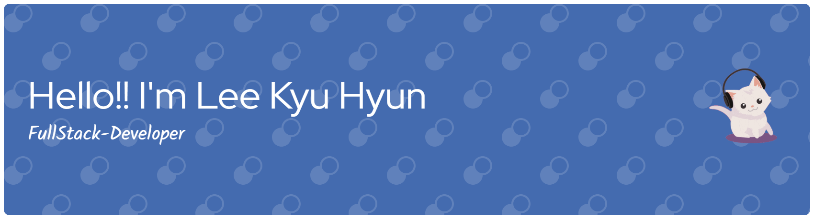

  
  
  
  

---

## 🏆 Achievements

- **Net 챌린지 캠프 시즌 12 (한국정보통신협회장상)**

---

## 🏃 Activity

- **KIT 바이브코딩 공모전 참가**

- **프로그래머스 웹 풀스택 데브코스 9기 수료**

---

## 📚 Tech Stack

#### Language
 

#### Front-End
  

#### Back-End

#### Database
  

#### Deployment
 

---

