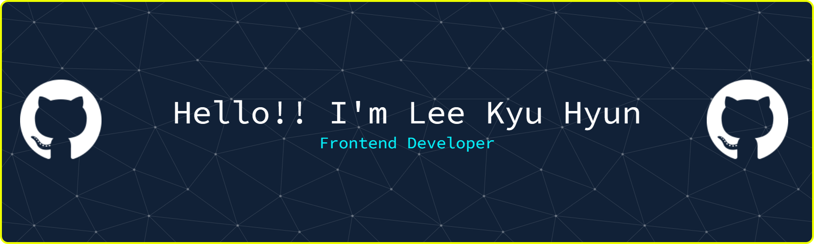

---

## 📈 GitHub Stats

  

    
    
  

---

## 🛠️ Tech Stack

<table align="center">
  <tr>
    <td align="center" width="180px"><strong>Language</strong></td>
    <td>
      
      
      
    </td>
  </tr>
  <tr>
    <td align="center"><strong>Frontend</strong></td>
    <td>
      
      
      
      
       
      
      
      
    </td>
  </tr>
  <tr>
    <td align="center"><strong>Backend</strong></td>
    <td>
      
      
      
    </td>
  </tr>
  <tr>
    <td align="center"><strong>Database</strong></td>
    <td>
      
    </td>
  </tr>
  <tr>
    <td align="center"><strong>AI & Productivity</strong></td>
    <td>
      
      
      
    </td>
  </tr>
  <tr>
    <td align="center"><strong>DevOps & Version Control</strong></td>
    <td>
      
      
      
    </td>
  </tr>
  <tr>
    <td align="center"><strong>Design & Collaboration</strong></td>
    <td>
      
      
    </td>
  </tr>
</table>

---

## 🚀 My Journey

  <i>"끊임없이 배우고 성장하며, 더 나은 사용자 경험을 만들기 위해 나아가는 저의 여정입니다."</i>

 

  
<strong>📚 What I'm Learning (현재 학습 중인 것)</strong>

   
  <ul>
    <li><b>Vue.js 반응형 시스템 및 성능 최적화</b>: Composition API와 렌더링 최적화 학습</li>
    <li><b>React Hook 기반 상태 관리</b>: Memoization을 활용한 UI 성능 최적화</li>
    <li><b>크로스 브라우징 (Cross-browsing)</b>: 최신 CSS 호환성 및 기기별 일관성 확보</li>
    <li><b>Pinia를 활용한 전역 상태 관리</b>: 모듈화된 스토어 설계 학습</li>
    <li><b>Vitest를 이용한 단위 테스트</b>: TDD 기반의 안정적인 코드 품질 확보</li>
  </ul>

  
<strong>🯠My Next Goals (ë‹¤ìŒ 학습 목표)</strong>

   
  <ul>
    <li><b>Next.js</b>: SSR, SSG를 통한 SEO 및 로딩 속도 최적화</li>
    <li><b>Tailwind CSS</b>: 유틸리티 우선 프레임워크를 이용한 맞춤형 디자인 시스템 구축</li>
    <li><b>GraphQL</b>: 효율적인 API 요청을 통한 데이터 통신 최적화</li>
    <li><b>배포 자동화 (GitHub Actions)</b>: CI/CD 파이프라인 구축 및 자동화된 테스트/배포</li>
    <li><b>Docker 컨테이너</b>: 개발 환경 일관성 확보 및 DevOps 이해</li>
  </ul>

---
